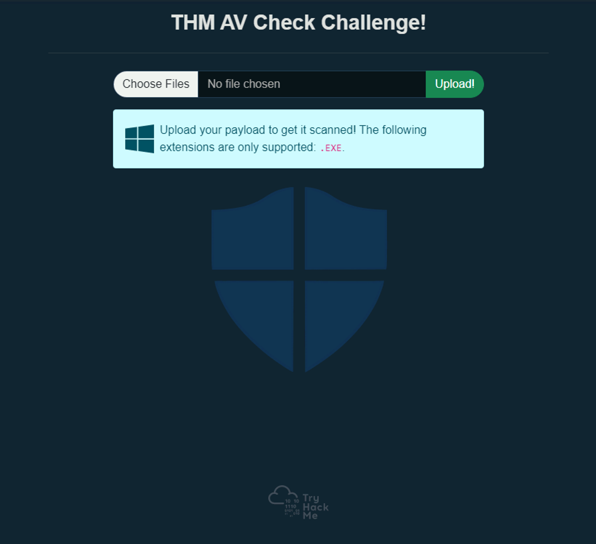
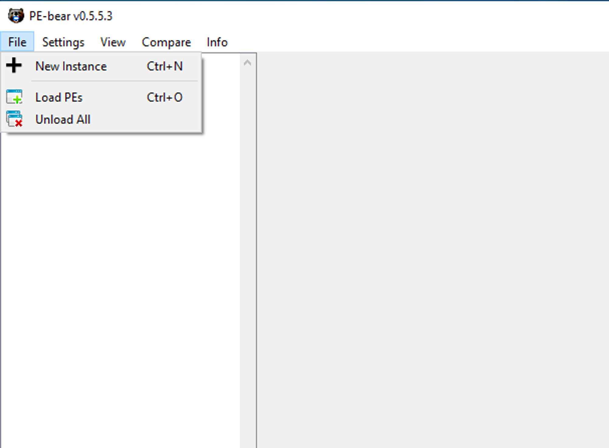
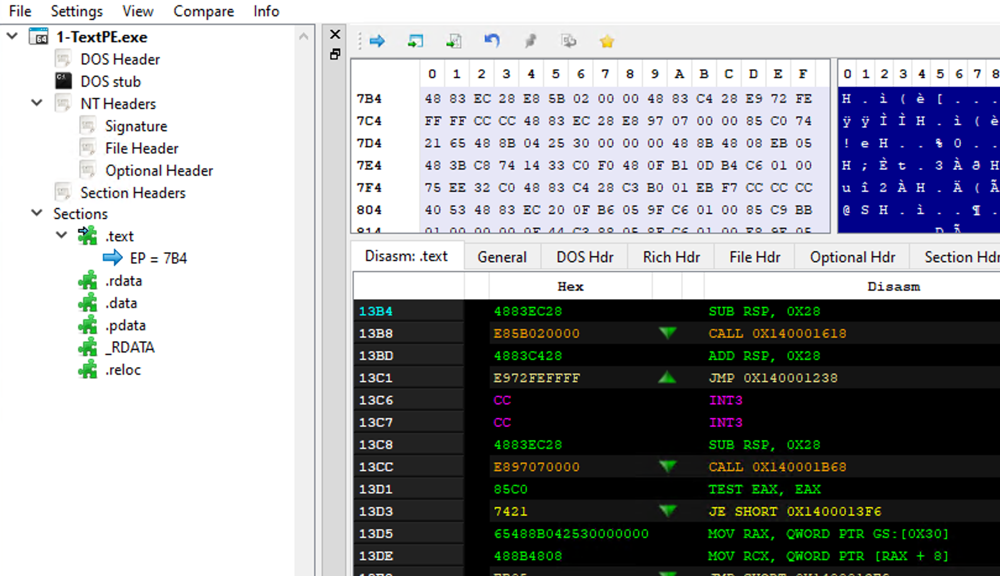

# THM_AV_Evasion-Shellcode
TryHackMe tutorial on AV Evasion with shellcode

# AV Evasion: Shellcode

# **AV Evasion: Shellcode**

Learn shellcode encoding, packing, binders, and crypters.

LINKS:
[https://tryhackme.com/r/room/avevasionshellcode](https://tryhackme.com/r/room/avevasionshellcode)
[https://tryhackme.com/room/windowsinternals](https://tryhackme.com/room/windowsinternals)

[https://docs.microsoft.com/en-us/windows/win32/debug/pe-format](https://docs.microsoft.com/en-us/windows/win32/debug/pe-format)
[https://www.notion.so/EICAR-cfe6a8066a6a4ab995f86ac9af78be10?pvs=4](https://www.notion.so/EICAR-cfe6a8066a6a4ab995f86ac9af78be10?pvs=21)

[https://blog.rchapman.org/posts/Linux_System_Call_Table_for_x86_64/](https://blog.rchapman.org/posts/Linux_System_Call_Table_for_x86_64/)

[https://github.com/mvelazc0/defcon27_csharp_workshop/blob/master/Labs/lab2/2.cs](https://github.com/mvelazc0/defcon27_csharp_workshop/blob/master/Labs/lab2/2.cs)

[https://github.com/mkaring/ConfuserEx/releases/tag/v1.6.0](https://github.com/mkaring/ConfuserEx/releases/tag/v1.6.0)

[https://tryhackme.com/room/runtimedetectionevasion](https://tryhackme.com/room/runtimedetectionevasion)


abf766d3dc25eeac73e3dc9d0ad40e6e  ted

0387265c30efa8ffca059d2ccfd36601  ted.asm

19c14ac23a32a9dfbacd152afccc978c  ted.c

f806c50401b76822ff43e7bd396170da  ted.o

4eed7e6a2689ac26d5a28e29118c9a5d  ted.text

022e0f8dd805ff5d7bd8da0129d18012  tedx

49cd3e752d8c8ee267113bf88a606081  eicar

4308ec7669a0e192f0b5ff8f4d70b9cc  eicar.asm

c7a6432fcbe6e7b093670422c7a68b95  eicar.c

fb8ec642f8dcfd7a40e8e3a6db232045  eicar.o

7c5d63293f6a2eb6ba3024bed2b2a7fa  eicar.text

ac00021083c43a64432cd3439f8bb03b  eicarx

a4b79d55944c9c7e1a7e688fdc6d3b88  calc.c

6bffb2b25cf3cc3c72bbca2b2269e8e2  calc-MSF.exe

cf392160516c6d8b5259144d87b92ce5  injector_template

e471531524c78f9bd7cc52caf85830b3  injector_template_windows

encXFER.tar.gz.aes

xfer2_enc_tar.gz.aes :: md5 hash:  13c466b5a55afbdc9392b84552d953a8  -

```bash
find xfer2 -type f -exec md5sum {} + | md5sum
13c466b5a55afbdc9392b84552d953a8  -

```


# Task 1: Intro

Task 1 Introduction

In this room, we'll explore how to build and deliver payloads, focusing on avoiding detection by common AV engines. We'll look at different techniques available to us as attackers and discuss the pros and cons of every one of them.

# Objectives

- Learn how shellcodes are made.
- Explore the pros and cons of staged payloads.
- Create stealthy shellcodes to avoid AV detection.

# Prerequisites

It is recommended to have some prior knowledge of [how antivirus software works](https://tryhackme.com/room/introtoav) and a basic understanding of encryption and encoding. While not strictly required, some knowledge of basic assembly language can also be helpful. Also, we recommend having a basic understanding of reading code and understanding functions (C, C#).

Answer the questions below
Click and continue learning!
NAN


# Task 2 Challenge

Task 2 Challenge

Start Machine

In this challenge, we prepared a Windows machine with a web application to let you upload your payloads. Once uploaded, the payloads will be checked by an AV and executed if found to be clean of malware. The main goal of this challenge is to evade Antivirus software installed on the VM and capture the flag in the file system. Feel free to try all of the techniques discussed throughout the room by uploading them to **`http://MACHINE_IP/`**.

Points to remember:

- Try to combine the techniques discussed in this room.
- The website supports EXE files only.
- Once the AV scans the uploaded file and no malicious code is detected, the file gets executed. Thus, if everything is put together correctly, then you should receive a reverse shell.



You can ignore the questions for this task for now, but be sure to come back to them once you have successfully bypassed the AV and gained a shell.

Deploy the attached VM to follow up with the content of the room before continuing to the next section! The VM will deploy in-browser and should appear automatically in the Split View. In case the VM is not visible, use the blue Show Split View button at the top-right of the page. If you prefer connecting via RDP, you can do so with the following credentials:


| Username | thm |
| --- | --- |
| Password | Password321 |

You will also need the AttackBox for some tasks, so this is also a good moment to start it.

Answer the questions below:

Which Antivirus software is running on the VM?
Submit

What is the name of the user account to which you have access?
Submit

Establish a working shell on the victim machine and read the file on the user's desktop. What is the flag?
Submit

[Answer](Task%202%20Challenge%20188a94696da94f81877feeda2489126c/Answer%2062b2c0072170444dada14972fa81576e.md)


# Task 3 PE Structure

This task highlights some of the high-level essential elements of PE data structure for Windows binaries.

# What is PE?

Windows Executable file format, aka PE (Portable Executable), is a data structure that holds information necessary for files. It is a way to organize executable file code on a disk. Windows operating system components, such as Windows and DOS loaders, can load it into memory and execute it based on the parsed file information found in the PE.

In general, the default file structure of Windows binaries, such as EXE, DLL, and Object code files, has the same PE structure and works in the Windows operating system for both (x86 and x64) CPU architecture.

A PE structure contains various sections that hold information about the binary, such as metadata and links to a memory address of external libraries. One of these sections is the **PE Header**, which contains metadata information, pointers, and links to address sections in memory. Another section is the **Data section**, which includes ****containers that include the information required for the Windows loader to run a program, such as the executable code, resources, links to libraries, data variables, etc.


There are different types of data containers in the PE structure, each holding different data.

1. **.text** stores the actual code of the program
2. **.data** holds the initialized and defined variables
3. **.bss** holds the uninitialized data (declared variables with no assigned values)
4. **.rdata** contains the read-only data
5. **.edata**: contains exportable objects and related table information
6. **.idata** imported objects and related table information
7. **.reloc** image relocation information
8. **.rsrc** links external resources used by the program such as images, icons, embedded binaries, and manifest file, which has all information about program versions, authors, company, and copyright!

The PE structure is a vast and complicated topic, and we are not going to go into too much detail regarding the headers and data sections. This task provides a high-level overview of the PE structure. If you are interested in gaining more information on the topic, we suggest checking the following THM rooms where the topic is explained in greater detail:

- [Windows Internals](https://tryhackme.com/room/windowsinternals): [https://tryhackme.com/room/windowsinternals](https://tryhackme.com/room/windowsinternals)
- Dissecting PE Headers

You can also get more in-depth details about PE if you check the [Windows PE format](https://docs.microsoft.com/en-us/windows/win32/debug/pe-format)'s Docs website. [https://docs.microsoft.com/en-us/windows/win32/debug/pe-format](https://docs.microsoft.com/en-us/windows/win32/debug/pe-format)

When looking at the PE contents, we'll see it contains a bunch of bytes that aren't human-readable. However, it includes all the details the loader needs to run the file. The following are the example steps in which the Windows loader reads an executable binary and runs it as a process.

1. Header sections: DOS, Windows, and optional headers are parsed to provide information about the EXE file. For example,
    - The magic number starts with "MZ," which tells the loader that this is an EXE file.
    - File Signatures
    - Whether the file is compiled for x86 or x64 CPU architecture.
    - Creation timestamp.
2. Parsing the section table details, such as
    - Number of Sections the file contains.
3. Mapping the file contents into memory based on
    - The EntryPoint address and the offset of the ImageBase.
    - RVA: Relative Virtual Address, Addresses related to Imagebase.
4. Imports, DLLs, and other objects are loaded into the memory.
5. The EntryPoint address is located and the main execution function runs.

# Why do we need to know about PE?

There are a couple of reasons why we need to learn about it. First, since we are dealing with packing and unpacking topics, the technique requires details about the PE structure.

The other reason is that AV software and malware analysts analyze EXE files based on the information in the PE Header and other PE sections. Thus, to create or modify malware with AV evasion capability targeting a Windows machine, we need to understand the structure of Windows Portable Executable files and where the malicious shellcode can be stored.

We can control in which Data section to store our shellcode by how we define and initialize the shellcode variable. The following are some examples that show how we can store the shellcode in PE:

1. Defining the shellcode as a local variable within the main function will store it in the **.TEXT** PE section.
2. Defining the shellcode as a global variable will store it in the **.Data** section.
3. Another technique involves storing the shellcode as a raw binary in an icon image and linking it within the code, so in this case, it shows up in the **.rsrc** Data section.
4. We can add a custom data section to store the shellcode.

# PE-Bear

The attached VM is a Windows development machine that has the tools needed to parse EXE files and read the details we discussed. For your convenience, we have provided a copy of the PE-Bear software on the Desktop, which helps to check the PE structure: Headers, Sections, etc. PE-Bear provides a graphic user interface to show all relevant EXE details. To load an EXE file for analysis, select **File** -> **Load PEs** (Ctrl + O).



Once a file is loaded, we can see all PE details. The following screenshot shows PE details of the loaded file, including the headers and sections we discussed earlier in this task.





Now it is time to try it out! Load the **thm-intro2PE.exe** file to answer the questions below. The file is located in the following location: **`c:\Tools\PE files\thm-intro2PE.exe`**.

Answer the questions below

What is the last 6 digits of the MD5 hash value of the **thm-intro2PE.exe** file?

530949

hint: Check the General tab and look for the MD5 value

What is the Magic number value of the thm-intro2PE.exe file (in Hex)?
5a4d

What is the Entry Point value of the thm-intro2PE.exe file?
12e4
Hint: Check the Optional Header tab and look for the Entry Point value.

How many Sections does the thm-intro2PE.exe file have?
7
Hint: Check the File Header section (Section Count) or count them manually.

A custom section could be used to store extra data. Malware developers use this technique to create a new section that contains their malicious code and hijack the flow of the program to jump and execute the content of the new section. What is the name of the extra section?
.flag

Check the content of the extra section. What is the flag?
THM{PE-N3w-s3ction!}

Hint: Select the Raw Address or Virtual Address value.
go to Section Hdrs, .flag, click on virtual address, look at ascii filed on top right.


# Task 4 Intro Shellcode

Task 4 Introduction to Shellcode


Shellcode is a set of crafted machine code instructions that tell the vulnerable program to run additional functions and, in most cases, provide access to a system shell or create a reverse command shell.

Once the shellcode is injected into a process and executed by the vulnerable software or program, it modifies the code run flow to update registers and functions of the program to execute the attacker's code.

It is generally written in Assembly language and translated into hexadecimal opcodes (operational codes). Writing unique and custom shellcode helps in evading AV software significantly. But writing a custom shellcode requires excellent knowledge and skill in dealing with Assembly language, which is not an easy task!

# A Simple Shellcode!

In order to craft your own shellcode, a set of skills is required:

- A decent understanding of x86 and x64 CPU architectures.
- Assembly language.
- Strong knowledge of programming languages such as C.
- Familiarity with the Linux and Windows operating systems.

To generate our own shellcode, we need to write and extract bytes from the assembler machine code. For this task, we will be using the AttackBox to create a simple shellcode for Linux that writes the string "THM, Rocks!". The following assembly code uses two main functions:

- System Write function (sys_write) to print out a string we choose.
- System Exit function (sys_exit) to terminate the execution of the program.

To call those functions, we will use **syscalls**. A syscall is the way in which a program requests the kernel to do something. In this case, we will request the kernel to write a string to our screen, and the exit the program. Each operating system has a different calling convention regarding syscalls, meaning that to use the write in Linux, you'll probably use a different syscall than the one you'd use on Windows. For 64-bits Linux, you can call the needed functions from the kernel by setting up the following values:

| rax | System Call | rdi | rsi | rdx |
| --- | --- | --- | --- | --- |
| 0x1 | sys_write | unsigned int fd | const char *buf | size_t count |
| 0x3c | sys_exit | int error_code |  |  |

The table above tells us what values we need to set in different processor registers to call the sys_write and sys_exit functions using syscalls. For 64-bits Linux, the rax register is used to indicate the function in the kernel we wish to call. Setting rax to 0x1 makes the kernel execute sys_write, and setting rax to 0x3c will make the kernel execute sys_exit. Each of the two functions require some parameters to work, which can be set through the rdi, rsi and rdx registers. You can find a complete reference of available 64-bits Linux syscalls [here](https://blog.rchapman.org/posts/Linux_System_Call_Table_for_x86_64/).

For **`sys_write`**, the first parameter sent through **`rdi`** is the file descriptor to write to. The second parameter in **`rsi`** is a pointer to the string we want to print, and the third in **`rdx`** is the size of the string to print.

For **`sys_exit`**, rdi needs to be set to the exit code for the program. We will use the code 0, which means the program exited successfully.

Copy the following code to your AttackBox in a file called **`thm.asm`**:

```bash
global _start

section .text
_start:
    jmp MESSAGE      ; 1) let's jump to MESSAGE

GOBACK:
    mov rax, 0x1
    mov rdi, 0x1
    pop rsi          ; 3) we are popping into `rsi`; now we have the
                     ; address of "THM, Rocks!\r\n"
    mov rdx, 0xd
    syscall

    mov rax, 0x3c
    mov rdi, 0x0
    syscall

MESSAGE:
    call GOBACK       ; 2) we are going back, since we used `call`, that means
                      ; the return address, which is, in this case, the address
                      ; of "THM, Rocks!\r\n", is pushed into the stack.
    db "THM, Rocks!", 0dh, 0ah
```

```bash
global _start
section .text
_start:
    jmp MESSAGE  ;1) let's jump to MESSAGE
GOBACK:
    mov rax, 0x1
    mov rdi, 0x1
    pop rsi      ; 3) we are popping into `rsi`; now we have the
                 ; address of "THM, Rocks!\r\n"
    mov rdx, 0xd
    syscall
    mov rax, 0x3c
    mov rdi, 0x0
    syscall

MESSAGE:
    call GOBACK ; 2) we are going back, since we used `call`, that means
                ; the return address, which is, in this case, the address
                ; of "THM, Rocks!\r\n", is pushed into the stack.
    db "THM, Rocks!", 0dh, 0ah

```

```bash
global _start
section .text
_start:
    jmp MESSAGE  ; 1) let's jump to MESSAGE
GOBACK:
    mov rax, 0x1
    mov rdi, 0x1
    pop rsi      ; 3) we are popping into `rsi`; now we have the
                 ; address of "TED, Rocks!\r\n"
    mov rdx, 0xd
    syscall
    mov rax, 0x3c
    mov rdi, 0x0
    syscall
MESSAGE:
    call GOBACK  ; 2) we are going back, since we used `call`, that means
                 ; the return address, which is, in this case, the address
                 ; of "TED, Rocks!\r\n", is pushed into the stack.
    db "TED, Rocks!", 0dh, 0ah

```

eicar.asm

```bash
section .data
    message db "X5O!P%@AP[4\ZX54(P^)7CC)7}%EICAR-STANDARD-ANTIVIRUS-TEST-FILE!$H+H*"
    message_length equ $ - message

section .text
    global _start

_start:
    jmp MESSAGE    ; 1) let's jump to MESSAGE

GOBACK:
    mov rax, 0x1
    mov rdi, 0x1
    pop rsi        ; 3) we are popping into `rsi`; now we have the
                   ; address of "message\r\n"
    mov rdx, message_length ; 4) length of the message
    syscall

    ; Exit the program
    mov rax, 0x3c  ;syscall number for sys_exit
    xor rdi, rdi   ;exit status 0
    syscall

MESSAGE:
    call GOBACK    ; 2) we are going back, since we used `call`, that means
                   ; the return address, which is, in this case, the address
                   ; of "message\r\n", is pushed into the stack.
    db 'X5O!P%@AP[4\ZX54(P^)7CC)7}%EICAR-STANDARD-ANTIVIRUS-TEST-FILE!$H+H*', 0dh, 0ah
```

from chatgpt:

### **Assembling and Linking**

To assemble and link the corrected code, use the following commands:

```bash

nasm -f elf64 -o message.o message.asm
ld -o message message.o
./message

```

Let's explain the ASM code a bit more. First, our message string is stored at the end of the .text section. Since we need a pointer to that message to print it, we will jump to the call instruction before the message itself. When **`call GOBACK`** is executed, the address of the next instruction after call will be pushed into the stack, which corresponds to where our message is. Note that the 0dh, 0ah at the end of the message is the binary equivalent to a new line (\r\n).

Next, the program starts the GOBACK routine and prepares the required registers for our first sys_write() function.

- We specify the sys_write function by storing 1 in the rax register.
- We set rdi to 1 to print out the string to the user's console (STDOUT).
- We pop a pointer to our string, which was pushed when we called GOBACK and store it into rsi.
- With the syscall instruction, we execute the sys_write function with the values we prepared.
- For the next part, we do the same to call the sys_exit function, so we set 0x3c into the rax register and call the syscall function to exit the program.

Next, we compile and link the ASM code to create an x64 Linux executable file and finally execute the program.

Assembler and link our code

```
user@AttackBox$ nasm -f elf64 thm.asmuser@AttackBox$ ld thm.o -o thmuser@AttackBox$ ./thmTHM,Rocks!
```

```bash
root@ip-10-10-75-113:~# file ted.o
ted.o: ELF 64-bit LSB relocatable, x86-64, version 1 (SYSV), not stripped
root@ip-10-10-75-113:~# file ted
ted: ELF 64-bit LSB executable, x86-64, version 1 (SYSV), statically linked, not stripped
root@ip-10-10-75-113:~# file ted.asm
ted.asm: ASCII text
root@ip-10-10-75-113:~# 
```

We used the **`nasm`** command to compile the asm file, specifying the **`-f elf64`** option to indicate we are compiling for 64-bits Linux. Notice that as a result we obtain a .o file, which contains object code, which needs to be linked in order to be a working executable file. The **`ld`** command is used to link the object and obtain the final executable. The **`-o`** option is used to specify the name of the output executable file.

Now that we have the compiled ASM program, let's extract the shellcode with the **`objdump`** command by dumping the .text section of the compiled binary.

Dump the .text section

```bash
user@AttackBox$ objdump -d thmthm:     file format elf64-x86-64

Disassembly of section .text:

0000000000400080 <_start>:
  400080:	eb 1e                	jmp    4000a0

0000000000400082 :
  400082:	b8 01 00 00 00       	mov    $0x1,%eax
  400087:	bf 01 00 00 00       	mov    $0x1,%edi
  40008c:	5e                   	pop    %rsi
  40008d:	ba 0d 00 00 00       	mov    $0xd,%edx
  400092:	0f 05                	syscall
  400094:	b8 3c 00 00 00       	mov    $0x3c,%eax
  400099:	bf 00 00 00 00       	mov    $0x0,%edi
  40009e:	0f 05                	syscall

00000000004000a0 :
  4000a0:	e8 dd ff ff ff       	callq  400082
  4000a5:	54                   	push   %rsp
  4000a6:	48                   	rex.W
  4000a7:	4d 2c 20             	rex.WRB sub $0x20,%al
  4000aa:	52                   	push   %rdx
  4000ab:	6f                   	outsl  %ds:(%rsi),(%dx)
  4000ac:	63 6b 73             	movslq 0x73(%rbx),%ebp
  4000af:	21                   	.byte 0x21
  4000b0:	0d                   	.byte 0xd
  4000b1:	0a                   	.byte 0xa
```

Now we need to extract the hex value from the above output. To do that, we can use **`objcopy`** to dump the **`.text`** section into a new file called **`thm.text`** in a binary format as follows:

Extract the .text section

```bash
user@AttackBox$ objcopy -j .text -O binary thm thm.text
```

The thm.text contains our shellcode in binary format, so to be able to use it, we will need to convert it to hex first. The **`xxd`** command has the **`-i`** option that will output the binary file in a C string directly:

Output the hex equivalent to our shellcode

```
user@AttackBox$ xxd -i thm.textunsigned char new_text[] = {
  0xeb, 0x1e, 0xb8, 0x01, 0x00, 0x00, 0x00, 0xbf, 0x01, 0x00, 0x00, 0x00,
  0x5e, 0xba, 0x0d, 0x00, 0x00, 0x00, 0x0f, 0x05, 0xb8, 0x3c, 0x00, 0x00,
  0x00, 0xbf, 0x00, 0x00, 0x00, 0x00, 0x0f, 0x05, 0xe8, 0xdd, 0xff, 0xff,
  0xff, 0x54, 0x48, 0x4d, 0x2c, 0x20, 0x52, 0x6f, 0x63, 0x6b, 0x73, 0x21,
  0x0d, 0x0a
};
unsigned int new_text_len = 50;
```

```bash
root@ip-10-10-75-113:~# xxd -i ted.text 
unsigned char ted_text[] = {
  0xeb, 0x1e, 0xb8, 0x01, 0x00, 0x00, 0x00, 0xbf, 0x01, 0x00, 0x00, 0x00,
  0x5e, 0xba, 0x0d, 0x00, 0x00, 0x00, 0x0f, 0x05, 0xb8, 0x3c, 0x00, 0x00,
  0x00, 0xbf, 0x00, 0x00, 0x00, 0x00, 0x0f, 0x05, 0xe8, 0xdd, 0xff, 0xff,
  0xff, 0x54, 0x45, 0x44, 0x2c, 0x20, 0x52, 0x6f, 0x63, 0x6b, 0x73, 0x21,
  0x0d, 0x0a
};
unsigned int ted_text_len = 50;

```

```bash
root@ip-10-10-75-113:~# xxd -i eicar.text 
unsigned char eicar_text[] = {
  0xeb, 0x1c, 0xb8, 0x01, 0x00, 0x00, 0x00, 0xbf, 0x01, 0x00, 0x00, 0x00,
  0x5e, 0xba, 0x43, 0x00, 0x00, 0x00, 0x0f, 0x05, 0xb8, 0x3c, 0x00, 0x00,
  0x00, 0x48, 0x31, 0xff, 0x0f, 0x05, 0xe8, 0xdf, 0xff, 0xff, 0xff, 0x58,
  0x35, 0x4f, 0x21, 0x50, 0x25, 0x40, 0x41, 0x50, 0x5b, 0x34, 0x5c, 0x5a,
  0x58, 0x35, 0x34, 0x28, 0x50, 0x5e, 0x29, 0x37, 0x43, 0x43, 0x29, 0x37,
  0x7d, 0x25, 0x45, 0x49, 0x43, 0x41, 0x52, 0x2d, 0x53, 0x54, 0x41, 0x4e,
  0x44, 0x41, 0x52, 0x44, 0x2d, 0x41, 0x4e, 0x54, 0x49, 0x56, 0x49, 0x52,
  0x55, 0x53, 0x2d, 0x54, 0x45, 0x53, 0x54, 0x2d, 0x46, 0x49, 0x4c, 0x45,
  0x21, 0x24, 0x48, 0x2b, 0x48, 0x2a, 0x0d, 0x0a
};
unsigned int eicar_text_len = 104;

```

Finally, we have it, a formatted shellcode from our ASM assembly. That was fun! As we see, dedication and skills are required to generate shellcode for your work!

To confirm that the extracted shellcode works as we expected, we can execute our shellcode and inject it into a C program.

```c
#include <stdio.h>
int main(int argc, char **argv) {
    unsigned char message[] = {
        0xeb, 0x1e, 0xb8, 0x01, 0x00, 0x00, 0x00, 0xbf, 0x01, 0x00, 0x00, 0x00,
        0x5e, 0xba, 0x0d, 0x00, 0x00, 0x00, 0x0f, 0x05, 0xb8, 0x3c, 0x00, 0x00,
        0x00, 0xbf, 0x00, 0x00, 0x00, 0x00, 0x0f, 0x05, 0xe8, 0xdd, 0xff, 0xff,
        0xff, 0x54, 0x48, 0x4d, 0x2c, 0x20, 0x52, 0x6f, 0x63, 0x6b, 0x73, 0x21,
        0x0d, 0x0a
    };

    (*(void(*)())message)();
    return 0;
}
```

ted.c

```bash
#include <stdio.h>

int main(int argc, char **argv) {
    unsigned char message[] = {
        0xeb, 0x1e, 0xb8, 0x01, 0x00, 0x00, 0x00, 0xbf, 0x01, 0x00, 0x00, 0x00,
        0x5e, 0xba, 0x0d, 0x00, 0x00, 0x00, 0x0f, 0x05, 0xb8, 0x3c, 0x00, 0x00,
        0x00, 0xbf, 0x00, 0x00, 0x00, 0x00, 0x0f, 0x05, 0xe8, 0xdd, 0xff, 0xff,
        0xff, 0x54, 0x45, 0x44, 0x2c, 0x20, 0x52, 0x6f, 0x63, 0x6b, 0x73, 0x21,
        0x0d, 0x0a
    };

    (*(void(*)())message)();
    return 0;
}
```

eicar.c

```bash
#include <stdio.h>

int main(int argc, char **argv) {
    unsigned char message[] = {
        0xeb, 0x1c, 0xb8, 0x01, 0x00, 0x00, 0x00, 0xbf, 0x01, 0x00, 0x00, 0x00,
  0x5e, 0xba, 0x43, 0x00, 0x00, 0x00, 0x0f, 0x05, 0xb8, 0x3c, 0x00, 0x00,
  0x00, 0x48, 0x31, 0xff, 0x0f, 0x05, 0xe8, 0xdf, 0xff, 0xff, 0xff, 0x58,
  0x35, 0x4f, 0x21, 0x50, 0x25, 0x40, 0x41, 0x50, 0x5b, 0x34, 0x5c, 0x5a,
  0x58, 0x35, 0x34, 0x28, 0x50, 0x5e, 0x29, 0x37, 0x43, 0x43, 0x29, 0x37,
  0x7d, 0x25, 0x45, 0x49, 0x43, 0x41, 0x52, 0x2d, 0x53, 0x54, 0x41, 0x4e,
  0x44, 0x41, 0x52, 0x44, 0x2d, 0x41, 0x4e, 0x54, 0x49, 0x56, 0x49, 0x52,
  0x55, 0x53, 0x2d, 0x54, 0x45, 0x53, 0x54, 0x2d, 0x46, 0x49, 0x4c, 0x45,
  0x21, 0x24, 0x48, 0x2b, 0x48, 0x2a, 0x0d, 0x0a

    };

    (*(void(*)())message)();
    return 0;
}
```

injector_template for linux

```bash
#include <stdio.h>

int main(int argc, char **argv) {
    unsigned char message[] = {

    };

    (*(void(*)())message)();
    return 0;
}
```

Then, we compile and execute it as follows,

Compiler our C program

```bash
user@AttackBox$ gcc -g -Wall -z execstack thm.c -o thmx
user@AttackBox$ ./thmxTHM,Rocks!
```

Nice! it works. Note that we compile the C program by disabling the NX protection, which may prevent us from executing the code correctly in the data segment or stack.

Understanding shellcodes and how they are created is essential for the following tasks, especially when dealing with encrypting and encoding the shellcode.

Answer the questions below

Modify your C program to execute the following shellcode. What is the flag?

```markup
unsigned char message[] = {
  0xeb, 0x34, 0xb9, 0x00, 0x00, 0x00, 0x00, 0x5e, 0x48, 0x89, 0xf0, 0x80,
  0x34, 0x08, 0x01, 0x48, 0x83, 0xc1, 0x01, 0x48, 0x83, 0xf9, 0x19, 0x75,
  0xf2, 0xb8, 0x01, 0x00, 0x00, 0x00, 0xbf, 0x01, 0x00, 0x00, 0x00, 0xba,
  0x19, 0x00, 0x00, 0x00, 0x0f, 0x05, 0xb8, 0x3c, 0x00, 0x00, 0x00, 0xbf,
  0x00, 0x00, 0x00, 0x00, 0x0f, 0x05, 0xe8, 0xc7, 0xff, 0xff, 0xff, 0x55,
  0x49, 0x4c, 0x7a, 0x78, 0x31, 0x74, 0x73, 0x2c, 0x30, 0x72, 0x36, 0x2c,
  0x34, 0x69, 0x32, 0x30, 0x30, 0x62, 0x31, 0x65, 0x32, 0x7c, 0x0d, 0x0a
};
```

Submit

THM{y0ur-1s7-5h311c0d3}

Hint: Inject the shellcode into a C program and compile it using the gcc command.
