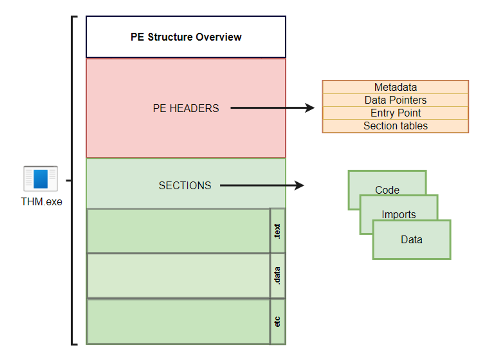
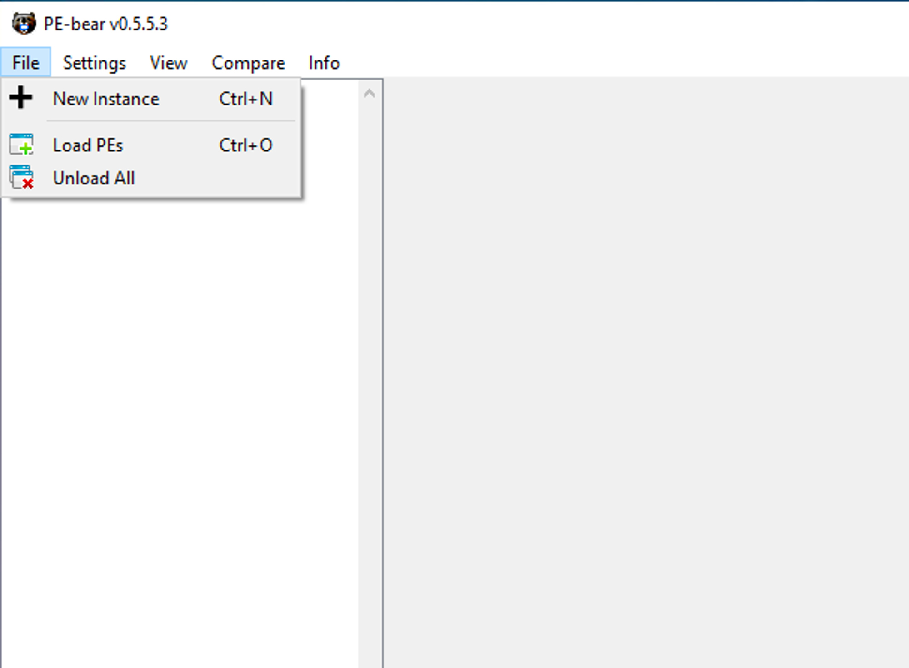
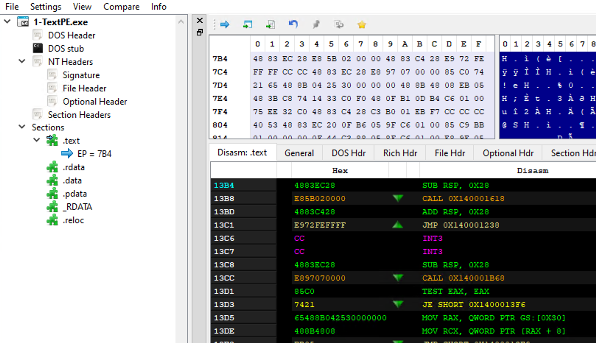

# Task 3 PE Structure

This task highlights some of the high-level essential elements of PE data structure for Windows binaries.

# What is PE?

Windows Executable file format, aka PE (Portable Executable), is a data structure that holds information necessary for files. It is a way to organize executable file code on a disk. Windows operating system components, such as Windows and DOS loaders, can load it into memory and execute it based on the parsed file information found in the PE.

In general, the default file structure of Windows binaries, such as EXE, DLL, and Object code files, has the same PE structure and works in the Windows operating system for both (x86 and x64) CPU architecture.

A PE structure contains various sections that hold information about the binary, such as metadata and links to a memory address of external libraries. One of these sections is the **PE Header**, which contains metadata information, pointers, and links to address sections in memory. Another section is the **Data section**, which includes ****containers that include the information required for the Windows loader to run a program, such as the executable code, resources, links to libraries, data variables, etc.

There are different types of data containers in the PE structure, each holding different data.

1. **.text** stores the actual code of the program
2. **.data** holds the initialized and defined variables
3. **.bss** holds the uninitialized data (declared variables with no assigned values)
4. **.rdata** contains the read-only data
5. **.edata**: contains exportable objects and related table information
6. **.idata** imported objects and related table information
7. **.reloc** image relocation information
8. **.rsrc** links external resources used by the program such as images, icons, embedded binaries, and manifest file, which has all information about program versions, authors, company, and copyright!

The PE structure is a vast and complicated topic, and we are not going to go into too much detail regarding the headers and data sections. This task provides a high-level overview of the PE structure. If you are interested in gaining more information on the topic, we suggest checking the following THM rooms where the topic is explained in greater detail:

- [Windows Internals](https://tryhackme.com/room/windowsinternals): [https://tryhackme.com/room/windowsinternals](https://tryhackme.com/room/windowsinternals)
- Dissecting PE Headers

You can also get more in-depth details about PE if you check the [Windows PE format](https://docs.microsoft.com/en-us/windows/win32/debug/pe-format)'s Docs website. [https://docs.microsoft.com/en-us/windows/win32/debug/pe-format](https://docs.microsoft.com/en-us/windows/win32/debug/pe-format)

When looking at the PE contents, we'll see it contains a bunch of bytes that aren't human-readable. However, it includes all the details the loader needs to run the file. The following are the example steps in which the Windows loader reads an executable binary and runs it as a process.

1. Header sections: DOS, Windows, and optional headers are parsed to provide information about the EXE file. For example,
    - The magic number starts with "MZ," which tells the loader that this is an EXE file.
    - File Signatures
    - Whether the file is compiled for x86 or x64 CPU architecture.
    - Creation timestamp.
2. Parsing the section table details, such as
    - Number of Sections the file contains.
3. Mapping the file contents into memory based on
    - The EntryPoint address and the offset of the ImageBase.
    - RVA: Relative Virtual Address, Addresses related to Imagebase.
4. Imports, DLLs, and other objects are loaded into the memory.
5. The EntryPoint address is located and the main execution function runs.

# Why do we need to know about PE?

There are a couple of reasons why we need to learn about it. First, since we are dealing with packing and unpacking topics, the technique requires details about the PE structure.

The other reason is that AV software and malware analysts analyze EXE files based on the information in the PE Header and other PE sections. Thus, to create or modify malware with AV evasion capability targeting a Windows machine, we need to understand the structure of Windows Portable Executable files and where the malicious shellcode can be stored.

We can control in which Data section to store our shellcode by how we define and initialize the shellcode variable. The following are some examples that show how we can store the shellcode in PE:

1. Defining the shellcode as a local variable within the main function will store it in the **.TEXT** PE section.
2. Defining the shellcode as a global variable will store it in the **.Data** section.
3. Another technique involves storing the shellcode as a raw binary in an icon image and linking it within the code, so in this case, it shows up in the **.rsrc** Data section.
4. We can add a custom data section to store the shellcode.

# PE-Bear

The attached VM is a Windows development machine that has the tools needed to parse EXE files and read the details we discussed. For your convenience, we have provided a copy of the PE-Bear software on the Desktop, which helps to check the PE structure: Headers, Sections, etc. PE-Bear provides a graphic user interface to show all relevant EXE details. To load an EXE file for analysis, select **File** -> **Load PEs** (Ctrl + O).

Once a file is loaded, we can see all PE details. The following screenshot shows PE details of the loaded file, including the headers and sections we discussed earlier in this task.

Now it is time to try it out! Load the **thm-intro2PE.exe** file to answer the questions below. The file is located in the following location: **`c:\Tools\PE files\thm-intro2PE.exe`**.

Answer the questions below

What is the last 6 digits of the MD5 hash value of the **thm-intro2PE.exe** file?

530949

hint: Check the General tab and look for the MD5 value

What is the Magic number value of the thm-intro2PE.exe file (in Hex)?

5a4d

What is the Entry Point value of the thm-intro2PE.exe file?

12e4

Hint: Check the Optional Header tab and look for the Entry Point value.

How many Sections does the thm-intro2PE.exe file have?

7

Hint: Check the File Header section (Section Count) or count them manually.

A custom section could be used to store extra data. Malware developers use this technique to create a new section that contains their malicious code and hijack the flow of the program to jump and execute the content of the new section. What is the name of the extra section?

.flag

Check the content of the extra section. What is the flag?

THM{PE-N3w-s3ction!}

Hint: Select the Raw Address or Virtual Address value.

go to Ection Hdrs, .flag, click on virtual address, look at ascii filed on top right.
