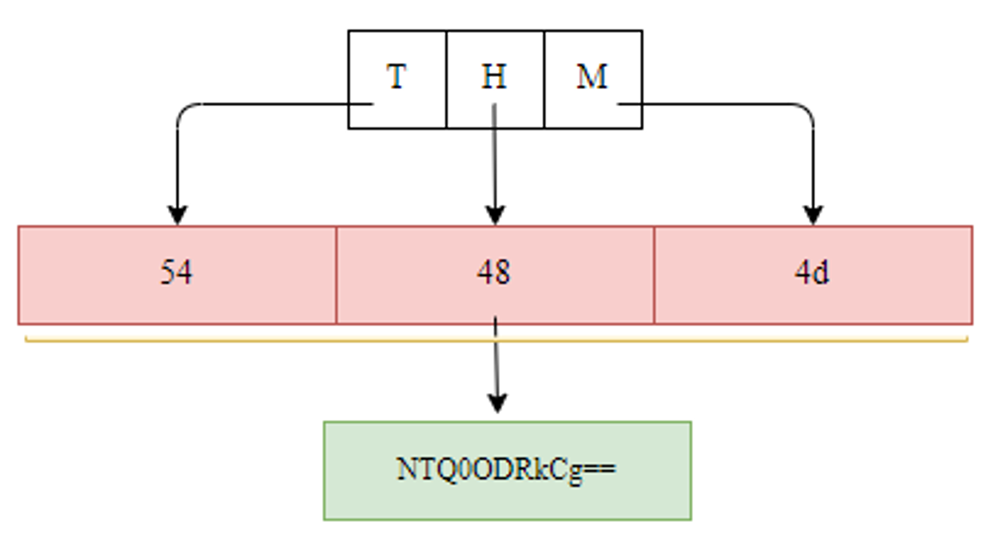
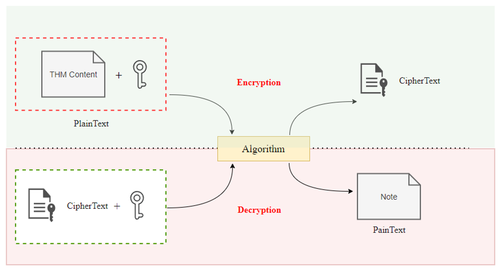

# Task 7 Introduction to Encoding and Encryption

Task 7 Introduction to Encoding and Encryption

# What is Encoding?

Encoding is the process of changing the data from its original state into a specific format depending on the algorithm or type of encoding. It can be applied to many data types such as videos, HTML, URLs, and binary files (EXE, Images, etc.).

Encoding is an important concept that is commonly used for various purposes, including but not limited to:

- Program compiling and execution
- Data storage and transmission
- Data processing such as file conversion

Similarly, when it comes to AV evasion techniques, encoding is also used to hide shellcode strings within a binary. However, encoding is not enough for evasion purposes. Nowadays, AV software is more intelligent and can analyze a binary, and once an encoded string is found, it is decoded to check the text's original form.

You can also use two or more encoding algorithms in tandem to make it harder for the AV to figure out the hidden content. The following figure shows that we converted the "THM" string into hexadecimal representation and then encoded it using Base64. In this case, you need to make sure that your dropper now handles such encoding to restore the string to its original state.

# What is Encryption?

Encryption is one of the essential elements of information and data security which focuses on preventing unauthorized access and manipulation of data. The encryption process involves converting plaintext (unencrypted content) into an encrypted version called Ciphertext. The Ciphertext can't be read or decrypted without knowing the algorithm used in encryption as well as the key.

Like encoding, encryption techniques are used for various purposes, such as storing and transmitting data securely, as well as end-to-end encryption. Encryption can be used in two ways: having a shared key between two parties or using public and private keys.

For more information about encryption, we encourage you to check [Encryption - Crypto 101](https://tryhackme.com/room/encryptioncrypto101) room.

# Why do we Need to Know About Encoding and Encryption?

AV vendors implement their AV software to blocklist most public tools (such as Metasploit and others) using static or dynamic detection techniques. Therefore, without modifying the shellcode generated by these public tools, the detection rate for your dropper is high.

Encoding and encryption can be used in AV evasion techniques where we encode and/or encrypt shellcode used in a dropper to hide it from AV software during the runtime. Also, the two techniques can be used not only to hide the shellcode but also functions, variables, etc. In this room, we mainly focus on encrypting the shellcode to evade Windows Defender.

Answer the questions below

Is encoding shellcode only enough to evade Antivirus software? (yea/nay)

nay

Do encoding techniques use a key to encode strings or files? (yea/nay)

nay

Do encryption algorithms use a key to encrypt strings or files? (yea/nay)

yea
